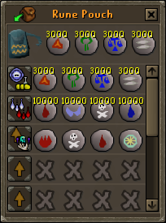

# Rune Pouch Loadouts  

A plugin to change the rune pouch loadout design, enabling custom loadout names.

Or even hide the loadout names alltogether.

Right click the "Load" button to rename a loadout.

Customize the loadout icon with the right click menu too.

Choose one of many hand-picked icons.

Add a second icon for multi-purpose loadouts

